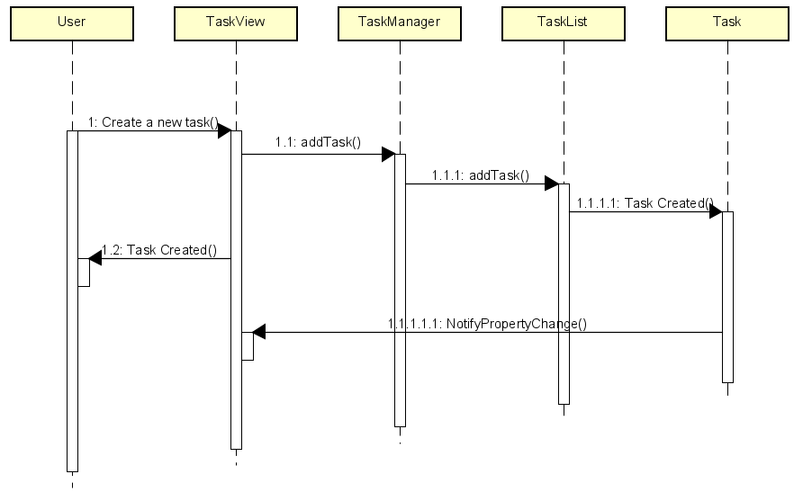
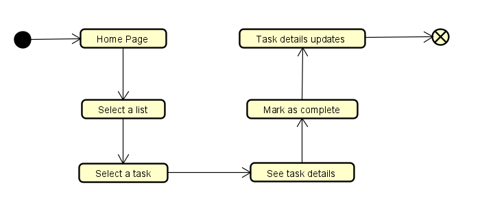
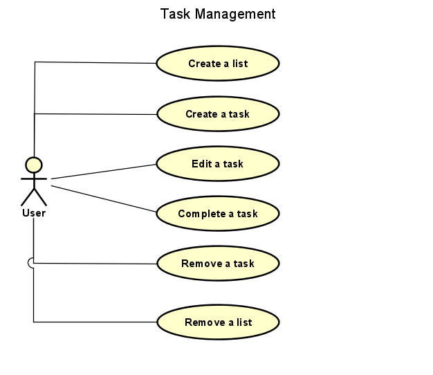
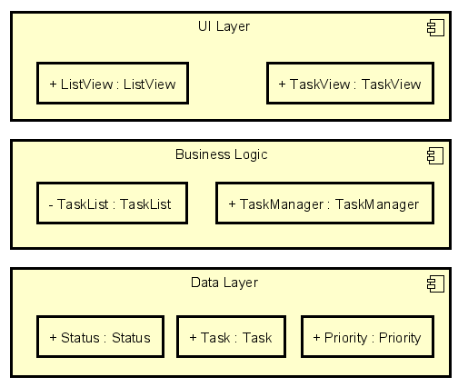
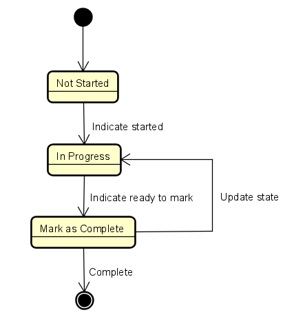

# Task Manager Application
## NHL Stenden | Final Assignment | C#2

## Table of Content
- [1. Objective](#1-objective)
- [2. Diagrams](#2-diagrams)
- [3. Features](#3-features)
- [4. Test Plan](#4-test-plan)
- [5. MoSCoW](#5-moscow)
- [6. Timetable](#6-timetable)
- [7. User Manual](#7-user-manual)
- [8. Additional Information](#8-additional-information)

## 1. Objective
The primary objective of this project is to develop a task management application utilizing C#. This application is intended to provide users with a clear and effective interface for task administration. By fostering user productivity, the application enables the straightforward creation, viewing, updating, and deletion of tasks, thereby assisting users in maintaining organization and focusing on their priorities.

### 1.1 Key Features
- Task creation, viewing, updating, and deletion
- Categorization of tasks
- Prioritization and deadline setting
- User-friendly interface
- Data Persistence
- Notifications and Reminders

## 2. Diagrams
### 2.1. Unified Modeling Language (UML) 
| Class | Description | Methods |
| --- | --- | --- |
| TaskManager | It contains a list of task lists (TaskList objects) and tracks the currently selected task. | It provides methods for creating, removing, and updating task lists, as well as methods for sorting and filtering tasks at the application level. Acts as the "Controller" in an MVC architecture. | 
| TaskList | It represents a list of tasks, containing a collection of Task objects. | It provides methods for adding, editing, removing tasks, and performing list-level operations like sorting, filtering, or searching tasks. |
| Task | It represents an individual task. Attributes include task name, description, due date, priority, and status. It may also include methods to update its attributes. | It implements INotifyPropertyChanged to notify the UI when properties (such as status) are updated. |
| Priority | This is an Enum task representing task priority (High, Medium, Low). | It is used to prioritize tasks for better management and display purposes. |
| Status | This is an enum representing task status (Completed, In Progress, Not Started). | It provides the foundation for task tracking and filtering. |
| TaskView | A user interface component that displays details for a selected task. | It provides buttons and forms to edit the task, mark it as completed, or delete it. Communicates changes to TaskList. |
| ListView | The view that displays all tasks in a selected TaskList. | Users can sort, filter, or search for tasks from this view, and it updates based on the TaskList data source. |

### 2.2 Class Relationships and Design Patterns
| Name | Description |
| --- | --- |
| **TaskManager** | It follows the Singleton pattern to ensure a single point of control for task management across the application. |
| **TaskList** | Each TaskList contains multiple Task objects, forming a one-to-many relationship. | 
| **Task** | It could implement the Observer pattern using events (e.g., INotifyPropertyChanged) to notify the user interface when task properties change. This ensures that updates in task details are reflected across all relevant views in real-time. | 
| **TaskView** and **ListView** | The Task class is bound to the user interface using data-binding principles. Whenever task attributes such as name, due date, or status are updated, the corresponding UI views are automatically updated to reflect these changes. | 
| **Status** and **Priority** | Both Priority and Status enums are used throughout the application for filtering, sorting, and intuitively displaying tasks. They also play a role in defining the business logic (e.g., only Progress tasks are displayed by default on the home screen). | 

### 2.3 Sequence Diagrams
It captures the interaction between different components or objects within the system over time.
##### 2.3.1 Task Creation
The steps to create a task by the user with appropriate methods involving list and UI updates.

### 2.4 Activity Diagram
It shows the workflow of tasks and operations in the system.
#### 2.4.1 Task Completion
The workflow how a completion of a task looks like within the app.

### 2.5 Use Case
It helps represent the different actions that users can perform within the application.

### 2.6 Component Diagram
It focuses on the high-level architecture of the application, showing the different components that make up the system.
- UI Components: TaskView, ListView, MainWindow
- Business Logic Components: TaskManager, TaskList, Task
- Data Components: Storage or Data Handling logic

### 2.7 State Diagram
Show the process of a task and how its state can change

## 3. Features
| Name | Version | Date | Note |
| --- | --- | --- | --- |
| Visual Studio 2022 | 17.8 | January 22, 2024 | The official source of the project. |
| WPF | 4.5 | February 6, 2023 | Windows Presentation Foundation (WPF) for creating the UI. | 
| .NET Framework | 7.0 | November 2022| The ASP.NET Core Runtime enables you to run existing web/server applications. |
| GitHub | 3.11.4 | January 30, 2024 | Version Control for the project. |
| Astah UML | 8.4 | February 10, 2024 | Used for creating class diagrams and other UML designs. |

## 4. Test Plan
Ensure the Task Manager application functions as intended, providing users with efficient task management capabilities.

### 4.1 Create a list
| Step | Title | Description | Expected Result |
| --- | --- | --- | --- |
| 4.1.1 | Start | Open the application. | The application starts running. |
| 4.1.2 | Create a new list | Create a new list with a name.	 | The home page is updated with the new list. |

### 4.2 Create a task
| Step | Title | Description | Expected Result |
| --- | --- | --- | --- |
| 4.1.1 | Start | Open the application. | The application starts running. |
| 4.1.2 | View a list | Select a task list.	 | The page of the selected list opens. |
| 4.1.3 | Create a new task | Open an input page of the task. | The task is successfully created. |
| 4.1.4 | Save | Save the attributes of the task. | The list page is updated with the new task. |

### 4.3 Edit a task in a list
| Step | Title | Description | Expected Result |
| --- | --- | --- | --- |
| 4.3.1 | Start | Open the application. | The application starts running. |
| 4.3.2 | View a list | Select a task list.	 | The page of the selected list opens. |
| 4.3.3 | View a task | Select a task.	| The page of the selected task opens. |
| 4.3.4 | Edit Task | Modify the task’s attributes (name, due date, priority, etc.).	| Task attributes are successfully updated. |
| 4.3.5 | Save | Save the edited task. | The list page is updated with the edited task. |

### 4.4 Remove a task from a list
| Step | Title | Description | Expected Result |
| --- | --- | --- | --- |
| 4.4.1 | Start | Open the application. | The application starts running. |
| 4.4.2 | View a list | Select a task list.	 | The page of the selected list opens. |
| 4.4.3 | View a task | Select a task to be removed.	| The page of the selected task opens. |
| 4.4.4 | Remove a task | Remove the task from the list.	 | The task is successfully deleted and removed from the list. |

### 4.5 Sort a list of tasks (ASC)
| Step | Title | Description | Expected Result |
| --- | --- | --- | --- |
| 4.5.1 | Start | Open the application. | The application starts running. |
| 4.5.2 | View a list | Select a task list.	 | The page of the selected list opens. |
| 4.5.3 | Sort by ASC order | Sort the tasks based on due date. | Tasks are correctly sorted by the names. |

### 4.6 Sort DESC a list of tasks (DESC)
| Step | Title | Description | Expected Result |
| --- | --- | --- | --- |
| 4.6.1 | Start | Open the application. | The application starts running. |
| 4.6.2 | View a list | Select a task list.	 | The page of the selected list opens. |
| 4.6.3 | Sort by DESC order | Sort the tasks based on priority. | Tasks are correctly sorted by the names. |

### 4.7 Filter a list of tasks by date
| Step | Title | Description | Expected Result |
| --- | --- | --- | --- |
| 4.7.1 | Start | Open the application. | The application starts running. |
| 4.7.2 | Filter by date | Filter the tasks based on the due date. | Tasks are correctly filtered by their due dates. |

### 4.8 Filter a list of tasks by priority
| Step | Title | Description | Expected Result |
| --- | --- | --- | --- |
| 4.8.1 | Start | Open the application. | The application starts running. |
| 4.8.2 | Filter by priority | Filter the tasks based on priority. | Tasks are correctly filtered by their priority. |

### 4.9 Filter a list of tasks by status
| Step | Title | Description | Expected Result |
| --- | --- | --- | --- |
| 4.9.1 | Start | Open the application. | The application starts running. |
| 4.9.2 | Filter by status | Filter the tasks based on status (e.g., In Progress, Completed). | Tasks are correctly filtered by their status. |

## 5. MoSCoW
### 5.1 Must-Have
| Title | Description |
| --- | --- |
| Add a list | As a user, I want to organize my tasks. |
| Edit a list | As a user, I want to change the name of the list. |
| Remove a list | As a user, I want to remove a list. |
| Add a task | As a user, I want to add tasks to a list. |
| Edit a task | As a user, I want to update my tasks. |
| Remove a task | As a user, I want to remove old tasks from the list. |

### 5.2 Should-Have
| Title | Description |
| --- | --- |
| View list | As a user, I want to view the tasks of a list. |
| View task | As a user, I want to see the details of a specific task. |
| Task Notifications | As a user, I want to receive notifications for upcoming, overdue tasks. |

### 5.3 Could-Have
| Title | Description |
| --- | --- |
| Filter the tasks | As a user, I want to filter tasks based on attributes like due date, priority, or status within the list. |
| Sort the tasks | As a user, I want to sort tasks based on their names (ASC, DESC). |
| Sort the lists | As a user, I want to sort lists based on their names (ASC, DESC). |

### 5.4 Won't-Have
| Title | Description |
| --- | --- |
| Attachments | Users won’t be able to attach images, documents, or other media to tasks. |
| Comments | Users won’t have the ability to add comments or notes within tasks. |
| Shares | There will be no built-in functionality for sharing tasks with other users. |

## 6. Timetable
These dates might be changed during the process of the project.
| Date | Title | Description | 
| --- | --- | --- |
| October 22 | Finalize |  Comment and review. Create a new presentation video. |
| October 21 | Update | Fix up the diagrams, documentation and implementation according to the feedback. |
| May 1 - June 2 | End | Write a User Manual for the Windows application.  |
| February 13 | Test | Debug and make sure the application runs. |
| February 12 | Dev | Make a fancy UI. Add comments and review the code. |
| February 11 | Dev | Fixing UI and methods. Remain tasks: sort, filter, edit date, priority, status. |
| February 6 | Dev | Building up the necessary methods of the project. |
| February 5 | Dev | Building up the structure of the project within Visual Studio. |
| February 4 | Start | Create the UML and a use case diagram. Write the start document. Plan out the project for the next days and weeks. Write user stories (MoSCoW). |

## 7. User Manual
#### 7.1 Introduction
The Task Manager application is designed to help users efficiently manage their tasks. This manual provides an overview of the application's features, how to use them, and troubleshooting tips.

### 7.2 Installation
1. Download the application from GitHub.
2. Extract the files to your desired location.
3. Double-click the TaskManager.exe file to launch the application.

### 7.3 User Interface Overview
- **Home Page:** Displays a summary of task lists.
- **Task List View:** Shows tasks under each list, with options to filter and sort.
- **Task Detail View:** Allows users to view and edit task details.

### 7.4 Basic Operations
- **Create a new list**
  1. On the Home Page, click "Add New List."
  2. Enter a name for the list and click "Save."
- **Add a new task**
  1. Select a list from the Task List View.
  2. Click "Add Task."
  3. Fill in the task details and click "Save."
- **Edit a task**
  1. Select a task from the Task List View.
  2. Click "Edit."
  3. Update the details and click "Save."
- **Remove a task**
  1. Select a task.
  2. Click "Remove" and confirm the deletion.
 
### 7.5 Troubleshooting
- **Application Crashes:** Ensure you have the latest version of .NET Framework installed. If issues persist, reinstall the application.
- **Tasks Not Updating:** Make sure to save changes after editing tasks.

## 8. Additional Information
### 8.1 Contact
For further assistance or to report bugs, please contact the developer at [virag.szabo@student.nhlstenden.com](mailto:virag.szabo@student.nhlstenden.com)

### 8.2 Version Control
The project is maintained on GitHub, where all changes are logged for accountability and version tracking.

### 8.3 Technology Stack
This application is built using C# and utilizes WPF for the user interface. The data layer is handled through .NET Framework technologies.

### 8.4 Future Enchancements
1. User Authentication: Implement user login and registration functionality to allow multiple users to have personalized task lists.
4. Search Functionality: Add a search feature that allows users to find tasks quickly based on keywords.
5. User Interface Enhancements: Improve the user interface by adding themes, customizable layouts, or better navigation features.
6. Mobile Compatibility: Develop a mobile version of the application for on-the-go task management.
7. Collaboration Features: Enable users to share tasks with others and collaborate on task completion.
8. Analytics Dashboard: Create a dashboard that provides insights into user productivity over time, such as completed tasks or time spent on tasks.
