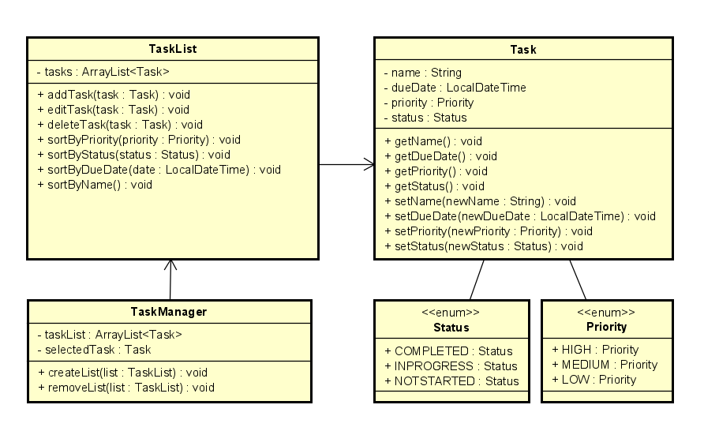
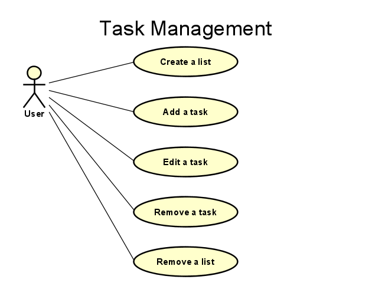

# Task Manager Application
## NHL Stenden | Final Assignment | C#2

### Table of Content
- [1. Objective](#1-objective)
- [2. Diagrams](#2-diagrams)
  - [2.1. Unified Modeling Language (UML)](#21-unified-modeling-language-uml)
  - [2.2. Use Case](#22-use-case)
- [3. Features](#3-features)
- [4. Test Plan](#4-test-plan)
  - [4.1 Task Creation](#41-task-creation)
  - [4.2 Task Editing](#42-task-editing)
  - [4.3 Task Deletion](#43-task-deletion)
  - [4.4 Task List Sorting](#44-task-list-sorting)
  - [4.5 Task Filtering](#45-task-filtering)
  - [4.6 Task List Interaction](#46-task-list-interaction)
  - [4.7 User Interface Responsiveness](#47-user-interface-responsiveness)
- [5. MoSCoW](#5-moscow)
  - [5.1 Must-Have](#51-must-have)
  - [5.2 Should-Have](#52-should-have)
  - [5.3 Could-Have](#53-could-have)
  - [5.4 Won't-Have](#54-wont-have)
- [6. Timetable](#6-timetable)
- [7. User Manual](#7-user-manual)
  - [7.1 Overview](#71-overview)
  - [7.2 Getting Started](#72-getting-started)
  - [7.3 User Interface](#73-user-interface)
  - [7.4 Task Management](#74-task-management)
- [8. Additional Information](#8-additional-information)

### 1. Objective
Develop a task manager application using C# that falls under the category of applications with a standard Windows GUI. The application should allow users to manage their tasks efficiently.

### 2. Diagrams
#### 2.1. Unified Modeling Language (UML) 
| Class | Description |
| --- | --- |
| TaskManager | Manages the overall application. Contains a list of the task lists and the currently selected task. Provides methods to create and remove lists. Includes methods for sorting tasks. | 
| TaskList | Represents a task list screen. Holds a list of tasks. Provides methods to add, edit, and remove tasks. Implements sorting and filtering functionality. |
| Task | It represents a task with attributes like name, due date, priority, and status. |
| Priority | This enum represents the priority of a task (High, Medium, Low). |
| Status | This enum represents the status of a task (Completed, In Progress, Not Started). |

#### 2.2. Use Case
The user interacts with the Task Manager App through various actions.

| Action | Description |
| --- | --- |
| Create Task List | The user can create a new task list. |
| Add Task | The user can add a new task to the task list. |
| Edit Task | The user can modify the attributes of an existing task. |
| Remove Task | The user can delete a task from the task list. |
| Remove Task List | The user can delete an entire task list. |

### 3. Features
| Name | Version | Date | Note |
| --- | --- | --- | --- |
| Visual Studio 2022 | 17.8 | January 22, 2024 | The official source of the project. |
| WPF | 4.5 | February 6, 2023 | Giving a visual presentation of the project. | 
| .NET Framework | 7.0 | November 2022| The ASP.NET Core Runtime enables you to run existing web/server applications. |
| GitHub | 3.11.4 | January 30, 2024 | Version Control for the project. |

### 4. Test Plan
Ensure the Task Manager application functions as intended, providing users with efficient task management capabilities.

#### 4.1 Task Creation
| Step | Title | Description | Expected Result |
| --- | --- | --- | --- |
| 4.1.1 | Start | Open the application. |
| 4.1.2 | New Task | Create a new task with various attributes (name, due date, priority, status). | The application successfully creates a new task. |
| 4.1.3 | Save | Save the task. | The application shows the new task on the screen. |

#### 4.2 Task Editing
| Step | Title | Description | Expected Result |
| --- | --- | --- | --- |
| 4.2.1 | Start | Open the application. | The application starts running. |
| 4.2.2 | Edit Task | Edit an existing task, modifying its attributes. | The application successfully edits the task. |
| 4.2.3 | Save | Save the task. | The application shows the changed value of the task. |

#### 4.3 Task Deletion
| Step | Title | Description | Expected Result |
| --- | --- | --- | --- |
| 4.3.1 | Start | Open the application. | The application starts running. |
| 4.3.2 | Remove Task | Delete an existing task. | The application successfully removes the selected task. |

#### 4.4 Task List Sorting
| Step | Title | Description | Expected Result |
| --- | --- | --- | --- |
| 4.4.1 | Start | Open the application. | The application starts running. |
| 4.4.2 | Sort List | Sort tasks by due date. | The tasks are going to be sorted by the selected due date. |
| 4.4.3 | Sort List | Sort tasks by priority. | The tasks are going to be sorted by the selected priority |
| 4.4.4 | Sort List | Sort tasks by status. | The tasks are going to be sorted by the selected status. |

#### 4.5 Task Filtering
| Step | Title | Description | Expected Result |
| --- | --- | --- | --- |
| 4.5.1 | Start | Open the application. | The application starts running. |
| 4.5.2 | Remove Task | Apply filters to display tasks based on due date. | The tasks are going to be filtered by the selected due date. |
| 4.5.3 | Remove Task | Apply filters to display tasks based on priority. | The tasks are going to be filtered by the selected priority. |
| 4.5.4 | Remove Task | Apply filters to display tasks based on status. | The tasks are going to be filtered by the selected status. |

#### 4.6 Task List Interaction
| Step | Title | Description | Expected Result |
| --- | --- | --- | --- |
| 4.6.1 | Start | Open the application. | The application starts running. |
| 4.6.2 | Edit Task | Select a task from the list. | Task details are displayed, and options (edit, delete) are available. |
| 4.6.3 | Save | Save the task. | The application shows the task on the screen. |

#### 4.7 User Interface Responsiveness
| Step | Title | Description | Expected Result |
| --- | --- | --- | --- |
| 4.7.1 | Start | Open the application. | The application starts running. |
| 4.7.2 | Window | Resize the application window. | UI elements adapt to different window sizes without loss of functionality. |
| 4.7.3 | Close | Close the application. | The application stops running. |

### 5. MoSCoW
#### 5.1 Must-Have
| Title | Description |
| --- | --- |
| Add a task | As a user, I want to add a new task to the task list with attributes like name, due date, priority, and status. |
| Edit a task | As a user, I want to edit an existing task's attributes to keep information up-to-date. |
| Remove a task | As a user, I want to delete a task from the list when it is no longer relevant. |

#### 5.2 Should-Have
| Title | Description |
| --- | --- |
| Task List Interactions | As a user, I want to interact with the task list, selecting and viewing tasks easily. |
| User Interface Responsiveness | As a user, I expect the application's user interface to be responsive to different window sizes. |

#### 5.3 Could-Have
| Title | Description |
| --- | --- |
| Sort tasks by due date | As a user, I want to sort tasks based on due date for better organization. |
| Sort tasks by priority | As a user, I want to sort tasks based on priority for better organization. |
| Sort tasks by status | As a user, I want to sort tasks based on status for better organization. |
| Filter tasks by due date | As a user, I want to apply filters to display tasks based on due date. |
| Filter tasks by priority | As a user, I want to apply filters to display tasks based on priority. |
| Filter tasks by status | As a user, I want to apply filters to display tasks based on status. |

#### 5.4 Won't-Have
| Title | Description |
| --- | --- |
| Add image | As a user, I don't need to add an image. |
| Add video | As a user, I don't need to add a video. |
| Add document | As a user, I don't need to add a document. |

### 6. Timetable
*These dates might be changed during the process of the project.*

| Date | Title | Description | 
| --- | --- | --- |
| February 4 | Start | Create the UML and a use case diagram. Write the start document. Plan out the project for the next days and weeks. Write user stories (MoSCoW). |
| February 5 | Dev | Building up the structure of the project within Visual Studio. |
| February 6 | Dev | Building up the necessary methods of the project. |
| February 11 | Dev | Fixing UI and methods. Remain tasks: sort, filter, edit date, priority, status. |
| February 12 | Dev | Make a fancy UI. Add comments and review the code. |
| February 13 | Test | Test. |
| May 1 - June 2 | End | Write a User Manual for the Windows application.  |

### 7. User Manual
#### 7.1 Overview
*This application increased productivity and was a great way to practice the C# programming language for something useful.*

#### 7.2 Getting Started
| Step | Title | Description |
| --- | --- | --- |
| 1 | Download | Clone the repository. |
| 2 | Open | Open the project in Visual Studio 2022 or Blend for Visual Studio 2022. |
| 3 | Start | Run the application. |
| 4 | Use | Start using the application (add, edit, remove). |

#### 7.3 User Interface
| Pages | Description |
| --- | --- |
| Home | See the task manager application. |
| Task List | See a task list with a default task. |

#### 7.4 Task Management
| Action | Description |
| --- | --- |
| Create | Add a new task to the list. |
| Edit | Edit a task on the list. |
| Delete | Remove a task you no longer need. |
| Sort | Sort your tasks as you wish to see them. |
| Filter | Filter your tasks as you wish to see them. |

### 8. Additional Information
Virag Szabo | BS | Information Technology | February - June 2024
